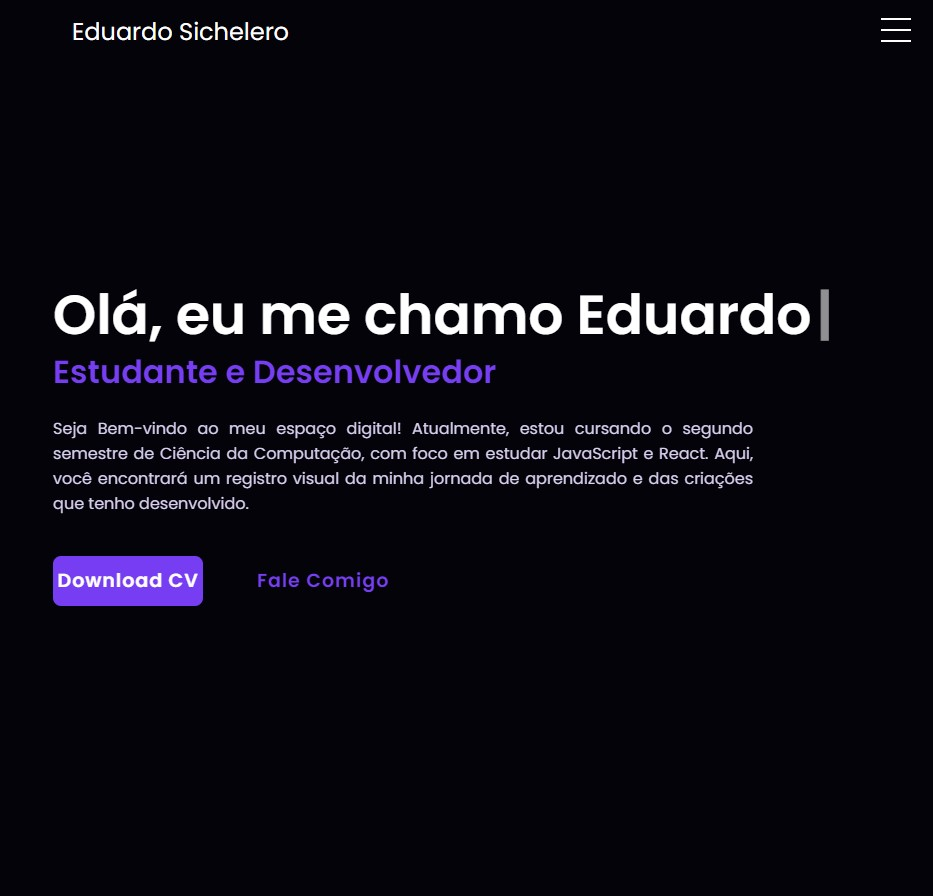

# Portifolio-HTML-CSS
Este repositório contém o projeto final desenvolvido como parte da disciplina de FRONT-END na Atitus Educação. O projeto consiste em um portfólio pessoal criado utilizando HTML e CSS. O objetivo principal é demonstrar habilidades na construção de interfaces web, aplicação de estilos e práticas de design responsivo. Sinta-se à vontade para explorar o código-fonte e verificar o resultado final do portfólio.

# Link para a Página

Link: https://eduardosichelero.github.io/Portifolio/

# Screenshot
Prévia do projeto :

